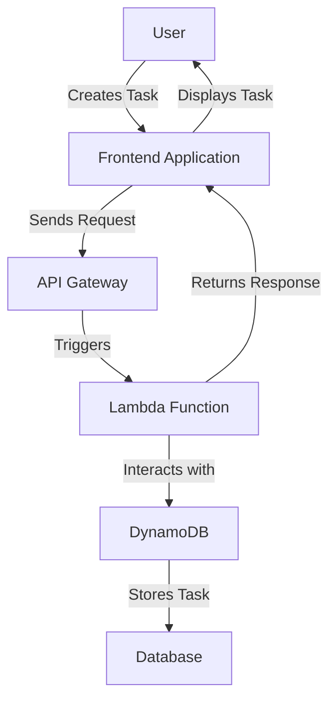
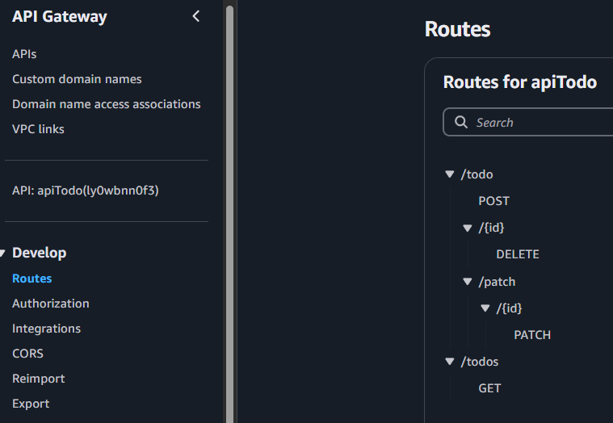
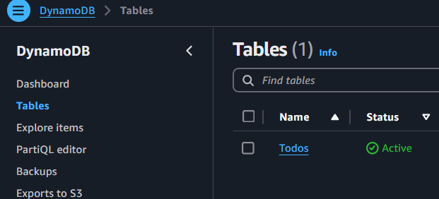
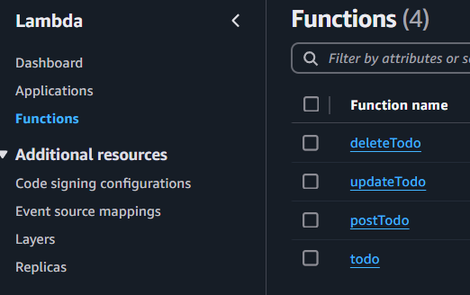

## Simple Todo App

This is a serverless Todo application that allows users to manage their tasks efficiently. The app provides the following features:

- **Add Tasks**: Users can create new tasks.
- **Mark as Done**: Tasks can be marked as completed, with a line-through style applied to indicate their status.
- **Delete Tasks**: Users can delete tasks they no longer need.
- **Filter Tasks**: Users can filter tasks to view all tasks, only completed tasks, or only active tasks.

All tasks are stored in a DynamoDB table, ensuring scalability and reliability. The architecture leverages AWS services such as API Gateway, Lambda, and DynamoDB for a fully serverless solution.

Deployed in KW14 2025.
Stack:
- React TS Frontend over AWS Amplify
- AWS API Gateway
- AWS Lambda
- AWS Dynamo DB

### Todo: Issue Board

#### Active Tasks

#### Done Tasks

- [x] **all done**
