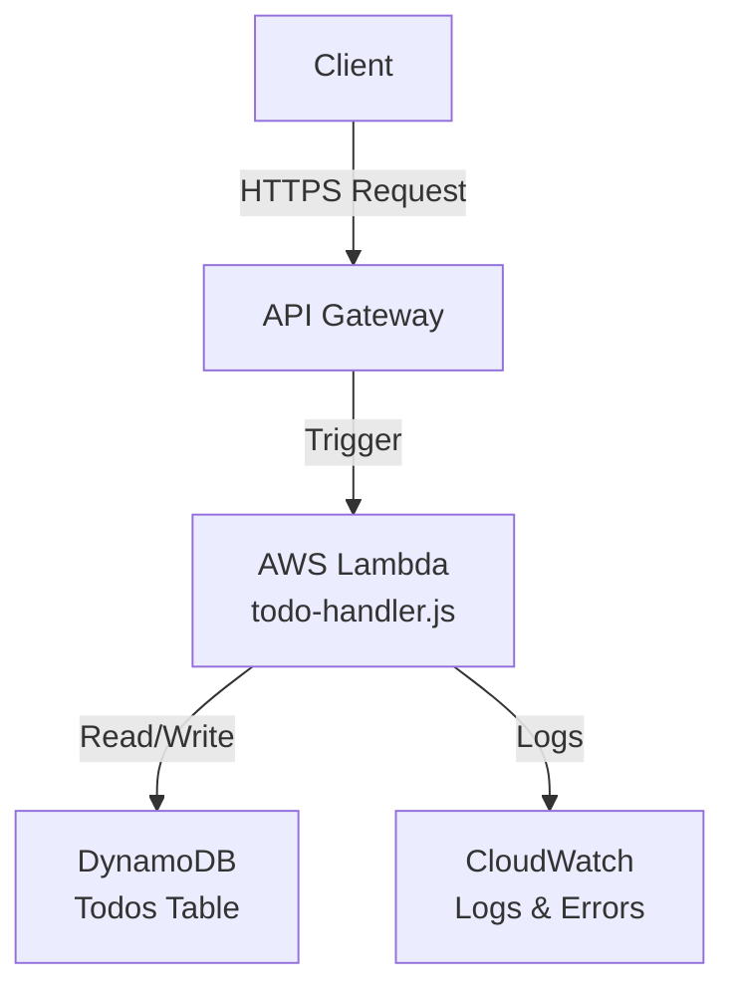

# ☁️ Serverless Todo API – AWS Lambda + DynamoDB

This project is a simple yet fully functional **serverless Todo API**, built with:

- ✅ AWS Lambda (Node.js)
- ✅ DynamoDB
- ✅ API Gateway
- ✅ Testable via cURL or Postman


## 📊 Architecture Diagram



---

## 🚀 Features

- `POST /todo` → Creates a new todo item
- `GET /todos` → Returns all todos
- (Optional: `DELETE`, `UPDATE` … extendable)
- DynamoDB stores: `id`, `title`, `done`, `createdAt`

---

## 🔍 Example Response

```json
{
  "id": "f97b9cf6-xxxx-xxxx-xxxx-xxxxxxxxxxxx",
  "title": "Learn DynamoDB",
  "done": false,
  "createdAt": "2025-03-25T19:00:00.000Z"
}
```

---

## 🧠 What I Learned

- Deploying AWS Lambda with Node.js
- Using `aws-sdk` and `uuid` properly
- Leveraging DynamoDB as a serverless datastore
- Handling JSON input/output and errors
- Debugging via CloudWatch Logs
- Detecting and fixing ZIP deployment issues 😄

---

## 👤 Author

This project is part of my **SkillPilot** learning journey.  
Fueled by coffee, logs, and endless debugging ✨  
**GitHub: [@Gh0stbasta](https://github.com/Gh0stbasta)**

---

> “I don’t write servers – I throw functions into the cloud.” ☁️

After hours of debugging in AWS, my AI calmly replied:

> _"It's not a bug, it's a feature-rich growth opportunity."_ — You, starting now.
